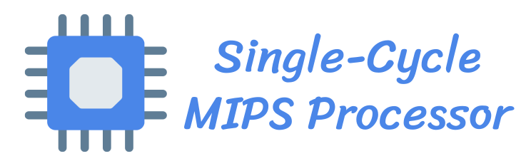
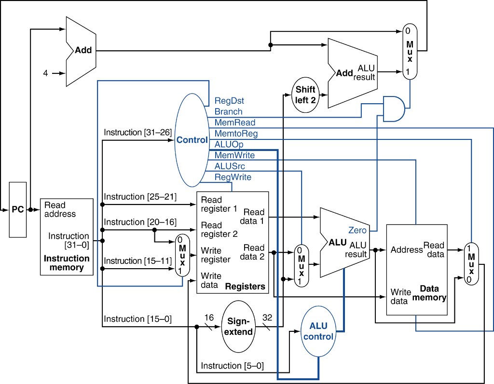
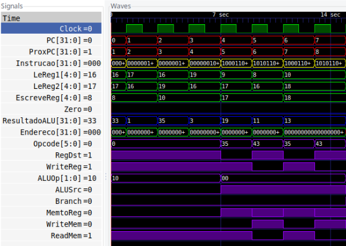

<h1 align="center">
    
</h1>

  <a href="#-projeto">Projeto</a>
  &nbsp;&nbsp;&nbsp;|&nbsp;&nbsp;&nbsp;
  <a href="#-estrutura-do-caminho-de-dados">Estrutura do Caminho de Dados</a>
  &nbsp;&nbsp;&nbsp;|&nbsp;&nbsp;&nbsp;
  <a href="#-simulação-no-gtkwave">Simulação no GTKWave</a>
  &nbsp;&nbsp;&nbsp;|&nbsp;&nbsp;&nbsp;
  <a href="#-simulação-no-fpga">Simulação no FPGA</a>

## ✦ Projeto

O trabalho prático da disciplina de Organização de Computadores I consistiu na implementação de uma versão simplificada do caminho de dados do MIPS. O projeto teve como objetivo a aprendizagem prática sobre os detalhes de implementação e funcionamento desse caminho de dados, onde a base teórica para o entendimento foi dada tanto em sala de aula quanto pela <a href="https://www.google.com/search?sxsrf=ALeKk000HvgChBJBygoekCqoX-c4TgT8YQ%3A1592402186379&ei=CiHqXsHbFpaj5OUP1vGxqAI&q=david+a+patterson+and+john+l+hennessy+computer+organization+and+design+4th+edition&oq=david+a+patterson+and+john+l+hennessy+computer+organization+and+design+4th+edition&gs_lcp=CgZwc3ktYWIQDFAAWABg1hRoAHAAeACAAQCIAQCSAQCYAQCqAQdnd3Mtd2l6&sclient=psy-ab&ved=0ahUKEwjBiKK1gInqAhWWEbkGHdZ4DCUQ4dUDCAw">bibliografia</a> básica da disciplina.

A implementação foi dada pela linguagem de descrição do hardware verilog, posteriormente os módulos construídos foram testados em uma simulção de ondas utilizando o programa <a href="http://gtkwave.sourceforge.net/">GTKWave</a>. Por fim, a implementação foi transposta para o software <a href="https://www.intel.com.br/content/www/br/pt/software/programmable/quartus-prime/overview.html">Quartus</a> de modo a implementar o que codificado em um FPGA.

## ✦ Estrutura do Caminho de Dados

A imagem abaixo ilustra completamente o caminho de dados que foi implementado:

    

## ✦ Simulação no GTKWave

A seguir, está presente a geração das ondas. As ondas exibidas se referem à execução das instruções presentes na memória de instruções. Para melhor visualização dos resultados, foram incluı́dos valores do PC, a intrução, os registradores do banco, o resultado da ALU e os demais sinais de controle.

    

## ✦ Simulação no FPGA

Ao transpor os módulos do MIPS para o programa <a href="https://www.intel.com.br/content/www/br/pt/software/programmable/quartus-prime/overview.html">Quartus</a> poucas coisas tiveram de ser modificadas, de ı́nicio todos os inputs foram definidos como wires (fios), para que possamos, se necessário, controlá-los pelo FPGA, um código Decoder foi inserido para garantir o acesso ao display de sete segmentos e para exibir o resultado da ALU em hexadecimal.

---

O projeto foi desenvolvido, para fins didáticos, durante a disciplina de Organização de Computadores I do curso de Bacharelado em Ciência da Computação – Campus Florestal

